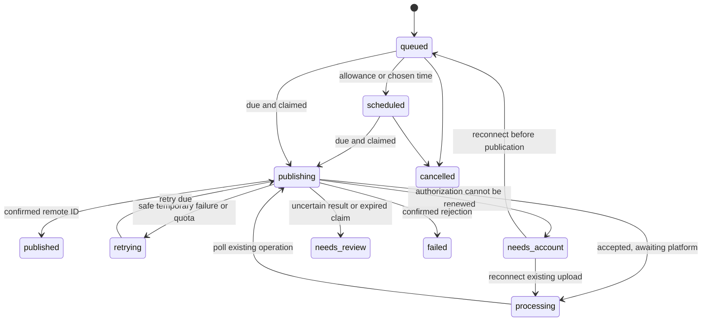

# Architecture and extension points

Meadow separates domain behavior, provider integrations, storage, transport, workers, and the interface. Classes own stateful behavior; small pure functions handle formatting and validation. Constructor injection makes services testable without credentials or live platform calls. The React interface is organized into independent feature modules.

## Composition and boundaries

`BridgeApplication` creates the repository, media storage, credential vault, locks, providers, and domain services. Its routes authenticate a Clerk user or a `br_live_` API key, parse requests, call the relevant service, and serialize results. API keys retain the creating user's workspace permissions, are returned in full only once, and are persisted as SHA-256 digests. Worker startup is separate from HTTP composition, so tests can exercise routes without publishing anything.

| Component | Responsibility |
| --- | --- |
| `ProjectService` | Project ownership, naming, timezone, record access |
| `AccountService` | OAuth lifecycle, account selection, encrypted tokens, proactive renewal and reconnection |
| `MediaService` / media storage | Byte validation, probing, private originals and derivatives, cache restoration, signed retrieval and retryable deletion |
| `PostService` | Normalization, provider validation, idempotent bulk submission, edits, cancellation, per-account reordering |
| `ScheduleService` | Explicit wall-clock/timezone conversion and DST validation |
| `RateLimitService` | Account-wide reservations, known rolling windows, provider blocks and replanning |
| `PublishingWorker` | Durable destination claims, uploads, polling, safe retries and interrupted-delivery recovery |
| `AnalyticsService` | Provider metric synchronization, null handling, aggregation and coverage |
| `ApiKeyService` | Hashed personal API-key creation, authentication, usage timestamps and revocation |
| `SqliteStore` | Durable entities, indexes, revisions, transactions, OAuth state and worker leases |
| `DurableDatabase` / `DurableState` | Verified SQLite restoration and atomic Durable Object snapshots, with generations that reject stale writers |

There is one logical post and one delivery per selected account. A post is the unit used for cross-account comparison. A delivery stores its own destination, requested time, effective queue time, progress, result, retry count, metrics, and immutable content snapshot once processing starts.

## Queue and publication behavior

1. Normalize a proposed batch and load current account publishing options.
2. Validate every destination and return a preview showing errors, requested times, quota delays, and uncertainty about unknown allowances.
3. On submission, hash the request content and store its idempotency key transactionally with posts and deliveries. Reusing the key with changed content is rejected.
4. Allocate posting slots per `platform:remoteAccountId`, shared across project connections to that same remote account. Only authenticated project members can see the project's records; shared quota reservations reveal no other project's content.
5. Workers select due destinations, process up to three distinct remote accounts concurrently, and lease one publishing operation per account. Claims are persisted before contacting the provider. Sequence counters keep same-millisecond submissions in order.
6. Providers await durable progress checkpoints and return either `published` with a confirmed remote identifier or `processing` with resumable progress. Polling continues from that progress without uploading again.
7. Confirmed success is terminal. Known temporary failures retry with backoff; a rate limit waits for the provider's reset or checks again when no reset was provided. Unknown publication outcomes become `needs_review`, requiring confirmation that no post exists before retrying.

Queued deliveries can be changed after another destination succeeds. Published destinations keep their original content snapshot. Editing is blocked while any destination is actively publishing, processing, or awaiting duplicate review. Queue arrows exchange the selected account's requested-time slots and order, then recalculate its allowance. Cancelling affects unpublished deliveries; deleting a partially published post is rejected atomically.

Exactly-once remote publication cannot be guaranteed by an application when a network response is lost. Meadow avoids automatic repeat publication in that case and exposes the uncertainty for review. Bluesky uses a deterministic record key; YouTube saves and queries its resumable upload session.

## Provider contract

A provider extends `PlatformProvider` and is registered in `ProviderRegistry`. Its public capability entry describes supported formats and baseline bounds. Providers override these methods where required:

- `authorizationUrl`, `exchange`, `refresh`: native OAuth and token lifecycle.
- `accounts`: eligible profiles/pages/channels/locations after authorization.
- `options`: dynamic privacy options, media constraints, boards and known quota rules.
- `validate`: platform-specific content/settings checks.
- `publish`: start publication and checkpoint durable intermediate IDs.
- `poll`: continue an accepted operation without resending it.
- `metrics`: return numeric values where available and explanatory notes otherwise.

HTTP adapters use `HttpTransport` to normalize authentication errors, rate limits, retryable failures, and uncertain mutations. Publishing requests are unsafe to retry by default. Upload/container creation is marked safe only when repeating it cannot itself publish another post. Provider payloads and tokens are not exposed in public delivery responses.

Signing out ends the Clerk session without removing social connections. Connection maintenance runs at startup and in bounded batches while the backend is awake; the daily Cloudflare cron wakes an idle backend. It renews credentials approaching expiry and periodically checks refreshable credentials without a reported lifetime. Refreshes sharing a grant are serialized, rotated credentials are persisted before use, and a delayed result cannot undo a newer connection or disconnect. A rejected access token gets one renewal attempt where supported. Network failures, rate limits, and application-credential or permission errors do not themselves erase a connection. A grant that cannot be renewed requires reconnection; platforms can revoke access or impose authorization lifetimes that Meadow cannot extend.

To add a platform, implement this contract, add a catalog entry, register the provider, and add any required destination controls. Add contract tests for its request shapes, polling transition, metrics and failure classification. Remove a provider through the registry or `BRIDGE_DISABLED_PLATFORMS`; existing history remains in storage. Re-enable a removed provider before retrying its queued work.

## Feature independence

The shell mounts `Composer`, `PostsQueue`, `Accounts`, and `Analytics` for the user's default project. The API client obtains a fresh Clerk session token for authenticated requests.

Browser uploads first send authenticated JSON `{ bytes }` to `POST /api/bridge/projects/:projectId/media/uploads`. The response contains a single-use `uploadToken` and `expiresAt`. The browser sends that token in the Authorization bearer header of the multipart `POST /media`; the grant lasts thirty minutes and permits only that project's exact declared file size. Its SHA-256 digest and owner are stored in one-time state, so replay and account deletion invalidate it. This avoids checking a one-minute Clerk JWT after a slow file transfer. Only the small authorization request may retry automatically; file transfers are sent once. The composer displays byte progress and then a separate media-preparation stage.

The public and authenticated interfaces share one plan catalog. `BillingService` creates Stripe subscription Checkout and Customer Portal sessions, verifies signed webhooks, and stores customer/subscription state by Clerk user ID. Paid-plan entitlement enforcement remains a separate future service. Collaborators can be introduced through a project-access service later. Neither concern is embedded in provider code or the media pipeline.

## Storage and operations

SQLite uses WAL mode, immediate write transactions, optimistic revisions, account/time indexes, one-time state, and heartbeating leases. AES-256-GCM credentials are bound to their account context. The encryption key is deployment configuration and is never stored with the database; preserve it across deployments and recovery.

On Cloudflare, `DurableState` stores the current SQLite snapshot in atomic chunks inside the existing Container Durable Object. Startup restores it, checks its checksum and SQLite integrity, and claims a new writer generation before starting workers. HTTP responses and critical background operations wait for `SqliteStore.flush()`. Snapshot sequence numbers make retries idempotent, and a superseded writer cannot commit. Missing or corrupt durable state prevents startup; persistence failure prevents acknowledgement. The current snapshot limit is 32 MiB, including all SQLite tables. Exceeding it fails closed and requires an operator to expand the storage implementation before further writes can succeed.

`DurableMediaStorage` streams originals and generated derivatives to private R2 before marking them ready. The container filesystem is an FFmpeg and download cache; files return lazily after replacement. Deletion saves its manifest before removing R2 objects and local copies, and retains failed work for maintenance to retry. The committed database and referenced media form one recovery set; do not expose an older database without replaying later deletion markers and removing erased media. The first rollout must capture the existing live database and media before replacing its container; see [deployment instructions](deployment.md).

Shutdown stops new work and waits briefly for active workers. If a provider has not answered before the process exits, saved progress and claims remain for recovery. Interrupted unconfirmed publication pauses for review.

The supplied deployment supports one active backend writer. Shared durable storage does not make independent backend instances safe; generation checks reject stale database commits but are not a multi-instance scheduler. Self-hosted deployments without the Cloudflare storage bridge still require a persistent local database/media volume; never put SQLite on a network filesystem. UI history reads currently return at most 10,000 records per collection/project; paging and archival remain extensions for larger installations. The publishing worker filters due active deliveries in SQL, and quota planning includes all pending deliveries for the relevant remote account.

Analytics refreshes run in bounded batches, with per-delivery timestamps and errors. Views are separate from engagement. Engagement sums reported likes, comments, shares and saves; coverage identifies partial component totals. Combined totals count activity, not unique people.
